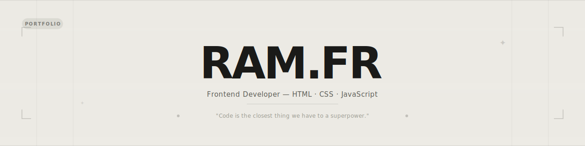

<div align="center">

<!-- BANNER -->


# ✦ RAM.FR — Portfolio

**"Code is the closest thing we have to a superpower."**

<br/>

[](https://developer.mozilla.org/en-US/docs/Web/HTML)
[](https://developer.mozilla.org/en-US/docs/Web/CSS)
[](https://developer.mozilla.org/en-US/docs/Web/JavaScript)
[](https://fontawesome.com)

<br/>


[](https://ramfr.vercel.app/)


<br/>

**[🌐 View Live →](https://ramfr.vercel.app/)**

</div>

---

## 📸 Preview

<div align="center">

> A minimal, modern frontend developer portfolio — no frameworks, no build tools, just clean code.
>
> 🔗 **[ramfr.vercel.app](https://ramfr.vercel.app/)**

</div>

---

## ✨ Features

<table>
<tr>
<td>

**UI & Animations**
- 🔤 Logo letter-by-letter animation
- ✍️ Hero title word-split stagger
- 👁️ Scroll reveal on all sections
- 📊 Scroll progress bar
- 🏷️ Infinite tech stack marquee
- 🎯 Interactive particle canvas (CTA)
- 🖱️ Custom lerp cursor (desktop)
- 🌊 Smart navbar (hide/show on scroll)

</td>
<td>

**Interactive**
- 🎵 Background music player
- 📸 Instagram modal (blur backdrop)
- 🔍 Project tag filters (work page)
- 💬 Hover tooltips
- 🔢 Number counter animation
- � Floating character cards (work page)

</td>
</tr>
</table>

---

## 📁 Project Structure

```
ram.fr/
├── index.html              # Main portfolio page
├── styles.css              # Global styles & animations
├── script.js               # Music, cursor, animations, banner
├── favicon.svg             # Site favicon
├── hand.svg                # Hero illustration
├── The Last of Us.mp3      # Background music
└── work/
    ├── index.html          # Projects page
    ├── work.css            # Work page styles
    └── work.js             # Filters & counters
```

---

## 🎨 Color Palette

<div align="center">

| Token | Hex | Usage |
|-------|-----|-------|
| `--bg` | `#eceae4` | Page background |
| `--surface` | `#f0ede6` | Cards & sections |
| `--ink` | `#1a1a18` | Primary text |
| `--ink-soft` | `#5a5a54` | Secondary text |
| `--ink-muted` | `#9a9a90` | Muted / labels |
| `--border` | `#dedad2` | Borders & dividers |
| `--white` | `#faf9f6` | White surface |

</div>

---

## 🛠️ Tech Stack

<div align="center">

| Technology | Usage |
|------------|-------|
| HTML5 | Structure & semantics |
| CSS3 | Styling, animations, responsive |
| Vanilla JS | Interactivity, canvas, DOM |
| Font Awesome 6 | Icons |
| Google Fonts — Inter | Typography |
| CSS Peeps | Character illustrations |
| Capsule Render | GitHub banner |

</div>

---

## 🚀 Getting Started

```bash
# 1. Clone the repo
git clone https://github.com/hac8k26/ram.fr.git

# 2. Open in browser
open index.html
```

> No install. No build step. No dependencies.

---

## ⚙️ Customization

| What | Where |
|------|-------|
| Name & bio | `index.html` → hero section |
| Projects | `index.html` + `work/index.html` |
| Music track | Replace `The Last of Us.mp3` |
| Colors | `styles.css` → `:root` variables |
| Instagram link | `index.html` → `#ig-banner` href |
| Social links | Navbar + footer in both HTML files |

---

## 🌐 Browser Support

| Chrome | Firefox | Safari | Edge |
|--------|---------|--------|------|
| ✅ | ✅ | ✅ | ✅ |

---

<div align="center">


Built with 🤍 by **[ramm.frr](https://www.instagram.com/ramm.frr/)**

</div>
# ramm.frr
